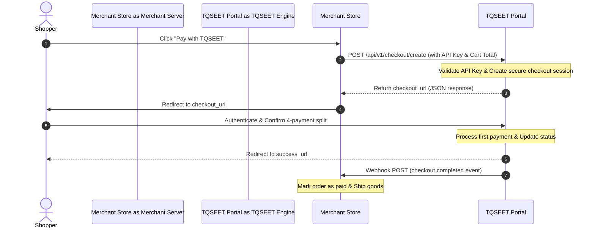

# Developer Integration & API Flow: Backend Compatibility Analysis

This document explains the standard REST API integration flow shown on our Developer portal (`views/public/business_docs.php`), maps it to TQSEET's current MVC code, and outlines paths forward for building real merchant API integration keys.

---

## 1. How the REST API Integration Flow Works (Industry Standards)

For external merchants (e.g. WooCommerce stores, Shopify, or custom platforms like Jumia) to integrate TQSEET as a checkout option, they follow this standard REST execution flow:

### Steps Breakdown:
1. **API Authentication**: The merchant retrieves their unique `Secret Key` (e.g. `sk_live_...`) from their TQSEET Merchant Dashboard. Every API call includes this key in the Authorization header.
2. **Session Creation**: When the shopper clicks TQSEET at checkout, the merchant's server makes a backend HTTP request to `POST /api/v1/checkout/create` specifying:
   * `amount` (total cart value)
   * `order_id` (merchant's reference ID)
   * `success_url` & `cancel_url`
3. **Redirect Handshake**: TQSEET responds with a JSON payload containing a temporary `checkout_url`. The merchant redirects the customer's browser to this URL.
4. **TQSEET Checkout Process**: On TQSEET's checkout portal, the shopper logs in, verifies their credit limit, and approves the split installments.
5. **Callback & Webhook**: Once approved, TQSEET redirects the shopper back to the merchant's `success_url`, and TQSEET's servers asynchronously ping the merchant's webhook endpoint to confirm payment completion in the background.

---

## 2. Do We Have This in Our Logic or Backend System?

**No, we do not currently have a REST API or webhook handler implemented in the backend.**

### Current State of the Codebase:
* **Internal Catalog Checkouts Only**: Order placement is handled strictly within TQSEET's internal MVC session system. A shopper browses our catalog (`views/public/catalog.php`), goes to the product detail page (`views/public/product_detail.php`), and clicks "Buy".
* **Cookie-Based Sessions**: The order is tied directly to the shopper's active PHP cookie session (`$_SESSION['user_id']`). There is no token validation or REST call.
* **Documentation is Mock-only**: The `business_docs.php` page is a visual mock-up showing how merchants *would* integrate our API, but the corresponding endpoints (like `POST /api/v1/checkout/create`) do not exist.

---

## 3. Options for Next Steps

### Option A: Retain as Mock Documentation (Stick with Catalog Prototype)
* **What it means**: We treat TQSEET purely as an integrated e-commerce catalog system (where the catalog and checkout live inside the same app). The Developer portal remains a marketing showcase for developers.
* **Pros**: Simple, requires no new API router files, database tables for API keys, or curl web request simulations.
* **Cons**: We cannot support third-party store checkouts.

### Option B: Build a Working API & Webhook Prototype
* **What it means**: We build a basic working version of the API so we can actually demonstrate external integration.
* **Database Updates**: Add an `api_key` column to the `merchants` table (e.g. `sk_test_12345`).
* **Endpoints to Create**:
  * Create `api/v1/checkout/create.php`: A script that receives JSON POST payloads, checks the API key against the database, inserts a draft order, and returns a checkout link.
  * Create a unified external checkout view (`views/checkout/external.php`) where external shoppers pay.
